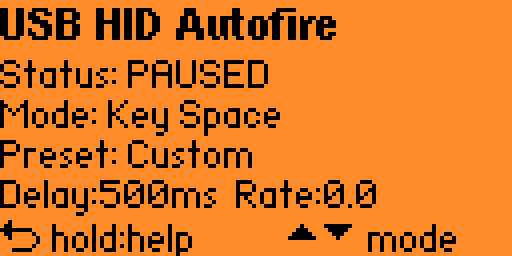
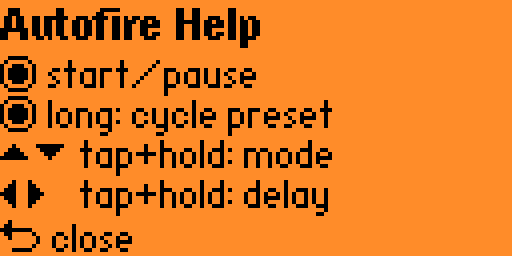

# USB HID Autofire

[GitHub](https://github.com/pbek/usb_hid_autofire) |
[Latest release](https://github.com/pbek/usb_hid_autofire/releases/latest) |
[Changelog](CHANGELOG.md) |
[License](LICENSE.md)

[](https://github.com/pbek/usb_hid_autofire/actions/workflows/build-test.yml)

This is a simple Flipper Zero application to send left-clicks as a USB HID device.

<table>
  <tr>
    <td align="center">
      
    </td>
    <td align="center">
      
    </td>
  </tr>
  <tr>
    <th align="center">Main screen</th>
    <th align="center">Help screen</th>
  </tr>
</table>

## Use-case

- Great for auto-clicking in games like [Idle Wizard](https://store.steampowered.com/app/992070/Idle_Wizard/) 😁

## Installation

Download the [latest release](https://github.com/pbek/usb_hid_autofire/releases/latest)
of the _fap_ file and put it into the `apps` folder on your SD card of your Flipper Zero.

## Building

```shell
cd applications_user
git clone https://github.com/pbek/usb_hid_autofire.git

cd ..

# Build the application
./fbt fap_usb_hid_autofire

# Build and launch the application
./fbt launch_app APPSRC=usb_hid_autofire
```

## Launch On Flipper From WSL

When VS Code runs in `Remote - WSL`, you can deploy and launch the app directly on a
USB-connected Flipper from WSL.

1. Attach the Flipper USB device to WSL from Windows PowerShell:

```powershell
usbipd list
usbipd bind --busid <BUSID>
usbipd attach --wsl --busid <BUSID>
```

2. In WSL, verify the device is available:

```shell
ls /dev/ttyACM*
```

3. Run launch from the firmware root:

```shell
./fbt launch APPSRC=applications_user/usb_hid_autofire
```

If your firmware/toolchain still uses the older launch target, use:

```shell
./fbt launch_app APPSRC=usb_hid_autofire
```

### Troubleshooting

- If you see `Permission denied: '/dev/ttyACM0'`, add your user to `dialout` and restart WSL:

```shell
sudo usermod -aG dialout "$USER"
```

Then run in Windows PowerShell:

```powershell
wsl --shutdown
```

- Close `qFlipper` while launching from WSL, otherwise the serial port may be busy.
